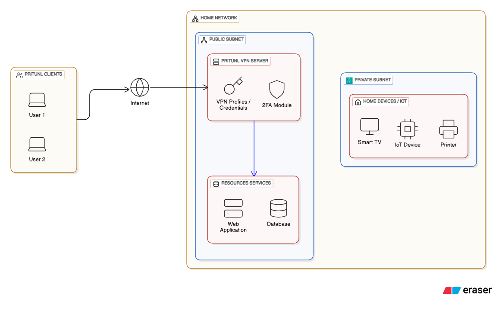

# HomeNetVPN

A simple solution to create a secure VPN, enabling safe remote access to a home network while keeping internal devices protected.

## Overview

HomeNetVPN provides a straightforward way to establish a secure VPN connection to your home network, allowing you to:
- Access home devices remotely
- Browse the internet through your home connection
- Maintain security and privacy while away from home
- Keep internal network devices protected from external threats

  

## Features

- 🔒 Secure encrypted connections
- 🏠 Remote access to home network resources
- 🛡️ Protection for internal devices
- ⚡ Simple setup and configuration
- 🔧 Lightweight and efficient

## Prerequisites

- Linux-based home server or router
- Static IP address or dynamic DNS service
- Port forwarding capability on your router
- Basic networking knowledge

## Configuration

1. **Server Setup**: Configure the VPN server on your home network
2. **Client Configuration**: Set up client devices for remote access
3. **Firewall Rules**: Configure appropriate security rules
4. **Port Forwarding**: Enable necessary ports on your router

## Usage
- Setting Up Pritunl on a Home Server Follow these steps to install Pritunl on a home server using this documentation:
https://docs.pritunl.com/kb/vpn/getting-started/installation

## Security Considerations

- Use strong authentication methods
- Regularly update certificates
- Monitor connection logs
- Implement fail2ban for brute force protection
- Keep software updated

## Troubleshooting

### Common Issues
- **Connection timeout**: Check firewall and port forwarding
- **Authentication failed**: Verify certificates and credentials
- **DNS resolution**: Ensure proper DNS configuration